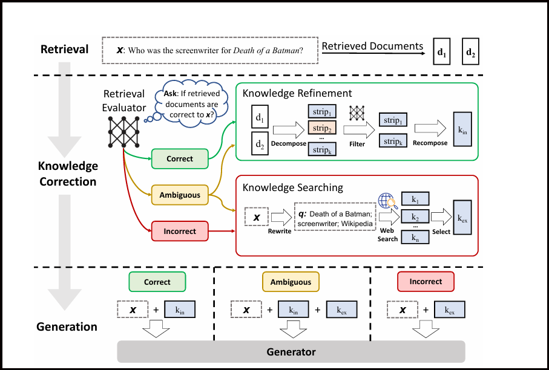

<div align="center">


<br/><br/>

# 🧠 CRAG - Corrective Retrieval-Augmented Generation

### *From research paper to working system - a full implementation of the CRAG pipeline*

<br/>

> **"A system that knows what it doesn't know and seeks external knowledge is more intelligent than one that clings to limited knowledge."**
> - *Yan et al., 2024 (CRAG Paper)*

<br/>

[📄 Research Paper](#-research-paper) •
[🏗️ Architecture](#%EF%B8%8F-architecture) •
[🔬 Pipeline Stages](#-pipeline-stages) •
[🚀 Getting Started](#-getting-started) •
[📓 Notebooks](#-notebook-progression) •
[🧪 What I Learned](#-what-i-learned)

</div>

---

## 🤔 Why CRAG? The Problem with Standard RAG

Standard **Retrieval-Augmented Generation (RAG)** blindly passes whatever documents the retriever finds straight into the LLM - even if those documents are completely wrong or irrelevant. This creates a silent failure mode: the model confidently hallucinates answers grounded in bad context.

**CRAG solves this by adding a self-correction layer.**

| | Standard RAG | CRAG |
|---|---|---|
| Retrieval quality check | ❌ None | ✅ Per-document scoring |
| Handles bad retrievals | ❌ Hallucinates | ✅ Falls back to web search |
| Knowledge refinement | ❌ Raw chunks | ✅ Decompose → Filter → Recompose |
| Web search fallback | ❌ No | ✅ Via Tavily + query rewriting |
| Mixed confidence handling | ❌ No | ✅ AMBIGUOUS action |

---

## 🏗️ Architecture

The full CRAG pipeline is implemented as a **LangGraph `StateGraph`** - each step is an explicit node with typed state transitions. This makes the flow inspectable, debuggable, and modular.



```
                        ┌─────────────────────────────────┐
                        │        User Question            │
                        └────────────┬────────────────────┘
                                     │
                              ┌──────▼──────┐
                              │   RETRIEVE  │  FAISS similarity search (k=4)
                              │    NODE     │  HuggingFace all-MiniLM-L6-v2
                              └──────┬──────┘
                                     │
                         ┌───────────▼───────────┐
                         │   RETRIEVAL EVALUATOR │  LLM scores each chunk [0.0–1.0]
                         │   (eval_each_doc_node)│  Structured output via Pydantic
                         └─────────┬─────────────┘
                                   │
               ┌───────────────────┼───────────────────┐
               │                   │                   │
          score > 0.7          mixed scores        all < 0.3
               │                   │                   │
        ┌──────▼──────┐   ┌────────▼────────┐  ┌──────▼──────────┐
        │  CORRECT ✅  │   │  AMBIGUOUS ⚠️   │   │  INCORRECT ❌   │
        └──────┬──────┘   └────────┬────────┘  └──────┬──────────┘
               │                   │                   │
               │             Both paths          ┌─────▼───────── ─┐
               │                   │             │  QUERY REWRITE  │
               │                   │             │  (LLM → keywords│
               │                   │             │  for web search)│
               │                   │             └─────┬───────────┘
               │                   │                   │
               │                   │             ┌─────▼──────────┐
               │                   │             │   WEB SEARCH   │
               │                   │             │  (Tavily API,  │
               │                   │             │   top-5 URLs)  │
               │                   │             └─────┬──────────┘
               │                   │                   │
               └───────────────────┼───────────────────┘
                                   │
                        ┌──────────▼───────────┐
                        │  KNOWLEDGE REFINER   │
                        │  Decompose → Filter  │
                        │     → Recompose      │
                        └──────────┬───────────┘
                                   │
                        ┌──────────▼───────── ─┐
                        │      GENERATE        │
                        │  (LLaMA-3.1-8B via   │
                        │      Groq API)       │
                        └──────────────────── ─┘
```

---

## 🔬 Pipeline Stages

### Stage 1 - Retrieval

PDF documents are loaded, chunked, embedded, and stored in FAISS. At query time, the top-4 most similar chunks are retrieved.

```python
chunks = RecursiveCharacterTextSplitter(
    chunk_size=900, chunk_overlap=150
).split_documents(docs)

embeddings = HuggingFaceEmbeddings(model_name="sentence-transformers/all-MiniLM-L6-v2")
vector_store = FAISS.from_documents(chunks, embeddings)
retriever = vector_store.as_retriever(search_type="similarity", search_kwargs={"k": 4})
```

---

### Stage 2 - Retrieval Evaluation

Every retrieved chunk is scored `[0.0, 1.0]` by an LLM judge using structured output (Pydantic). The scores determine which corrective action fires:

```python
class DocEvalScore(BaseModel):
    score: float   # 0.0 = irrelevant, 1.0 = fully answers the question
    reason: str

UPPER_TH = 0.7   # → CORRECT
LOWER_TH = 0.3   # → INCORRECT if ALL chunks below this
                  # → AMBIGUOUS otherwise
```

| Condition | Verdict | Next Action |
|---|---|---|
| Any chunk `score > 0.7` | `CORRECT` | Knowledge Refinement on good docs |
| All chunks `score < 0.3` | `INCORRECT` | Query Rewrite → Web Search |
| Neither | `AMBIGUOUS` | Both internal + external knowledge |

---

### Stage 3 - Knowledge Refinement

When retrieval is `CORRECT`, raw chunks still contain noise. This stage strips out irrelevant sentences at the sentence level:

```
Retrieved document (900 tokens)
        │
        ▼  decompose_to_sentences()
[s1, s2, s3, s4, s5, s6, ...]   ← sentence strips
        │
        ▼  LLM filter (KeepOrDrop per sentence)
[s1 ✅, s2 ❌, s3 ✅, s4 ❌, ...]
        │
        ▼  recompose
"s1. s3. ..."   ← refined_context (only relevant sentences)
```

**Result:** The LLM generates from a lean, high-signal context instead of 900 tokens of noise.

---

### Stage 4 - Web Search (INCORRECT path)

When the local vector store fails, CRAG doesn't give up - it rewrites the query into web-search keywords and fetches live results via Tavily:

```python
# Query rewriting (LLM → keyword query)
class WebQuery(BaseModel):
    query: str

rewrite_prompt = """
Rewrite the user question into a web search query composed of keywords.
- Keep it short (6–14 words).
- If the question implies recency, add a constraint like (last 30 days).
- Return JSON with a single key: query
"""

# Web search → Document objects
tavily = TavilySearchResults(max_results=5)
results = tavily.invoke({"query": web_query})
# → web_docs passed through the same refine() node
```

---

### Stage 5 - Generation

The final answer is generated using **LLaMA-3.1-8B-Instant** (via Groq API) with a strict context-only prompt:

```python
answer_prompt = ChatPromptTemplate.from_messages([
    ("system", "Answer ONLY using the provided context. If insufficient, say: 'I don't know.'"),
    ("human", "Question: {question}\n\nRefined context:\n{refined_context}"),
])
```

---

## 📓 Notebook Progression

This project was built **incrementally**, one concept at a time. Each notebook represents a learning milestone:

| Notebook | Concept Introduced | Key Addition |
|---|---|---|
| `hallucination-error_py.ipynb` | Baseline RAG | Standard retrieve → generate; shows how hallucination happens |
| `knowledge-refinement.ipynb` | Sentence-level filtering | `decompose_to_sentences()` + LLM `KeepOrDrop` filter |
| `knowledge-searching.ipynb` | Retrieval evaluation | `DocEvalScore` + CORRECT / INCORRECT / AMBIGUOUS routing |
| `ambiguous.ipynb` | Full three-way routing | Web search on INCORRECT; combined context on AMBIGUOUS |
| `Web_serach.ipynb` | Web search integration | Tavily `TavilySearchResults`, Document wrapping |
| `query_rewrite.ipynb` | Query rewriting | LLM rewrites question → keyword query before web search |

> **Each notebook builds on the last.** Reading them in order is the fastest way to understand why each design decision was made.

---

## 🚀 Getting Started

### Prerequisites

- Python 3.10+
- A [Groq API key](https://console.groq.com/) (free tier works)
- A [Tavily API key](https://app.tavily.com/) (free tier works)
- A [HuggingFace token](https://huggingface.co/settings/tokens)

### Installation

```bash
git clone https://github.com/<your-username>/crag-implementation.git
cd crag-implementation
python -m venv .venv
source .venv/bin/activate   # Windows: .venv\Scripts\activate
pip install -r requirements.txt
```

### Environment Setup

Create a `.env` file in the project root:

```env
HF_TOKEN="your_huggingface_token"
GROQ_API_KEY="your_groq_api_key"
TAVILY_API_KEY="your_tavily_api_key"
```

### Add Your Documents

Place your PDF files in a `Books/` folder:

```
crag-implementation/
├── Books/
│   ├── book1.pdf      ← your primary knowledge source
│   └── book2.pdf      ← optional additional sources
├── Web_serach.ipynb
├── query_rewrite.ipynb
├── ...
└── requirements.txt
```

### Run

Open any notebook in Jupyter and run all cells, or start from `query_rewrite.ipynb` for the most complete pipeline.

```bash
jupyter notebook query_rewrite.ipynb
```

---

## 📦 Tech Stack

| Component | Technology | Purpose |
|---|---|---|
| **Orchestration** | LangGraph `StateGraph` | Typed stateful pipeline with conditional routing |
| **LLM** | LLaMA-3.1-8B-Instant (Groq) | Evaluation, rewriting, generation |
| **Embeddings** | `all-MiniLM-L6-v2` (HuggingFace) | Semantic similarity for retrieval |
| **Vector Store** | FAISS (CPU) | Fast approximate nearest-neighbor search |
| **Document Loader** | `PyPDFLoader` (LangChain) | PDF ingestion and page extraction |
| **Text Splitter** | `RecursiveCharacterTextSplitter` | 900-token chunks, 150-token overlap |
| **Web Search** | Tavily API | Live web results for INCORRECT path |
| **Structured Output** | Pydantic + `with_structured_output` | Type-safe LLM outputs (scores, flags, queries) |
| **Environment** | `python-dotenv` | Secure API key management |

---

## 🧪 What I Learned

This project wasn't just a code exercise - it was a week-long deep dive into how production RAG systems actually need to work. Here are the real lessons:

### 1. RAG's Silent Failure Mode

The first notebook (`hallucination-error_py.ipynb`) revealed something unsettling: a standard RAG pipeline will confidently answer questions even when the retrieved context is completely wrong. There's no signal that anything went wrong. CRAG's entire value proposition is surfacing this hidden failure.

### 2. LLM-as-Judge Is Powerful but Needs Structure

Using an LLM to evaluate chunk relevance only works reliably when you force structured output via Pydantic. Free-form evaluation is inconsistent - `DocEvalScore` with a `float` score and `reason` made the evaluator both auditable and stable.

### 3. Sentence-Level Refinement Matters

Chunking at 900 tokens means most retrieved chunks contain both relevant and irrelevant sentences. The `decompose_to_sentences()` → `KeepOrDrop` filter step cut significant noise and consistently improved answer quality - especially on narrow, factual questions.

### 4. Query Rewriting Is Non-Negotiable for Web Search

Passing raw user questions to Tavily ("What are attention mechanisms?") returned mediocre results. Rewriting to keyword queries ("attention mechanisms transformers NLP definition 2024") returned dramatically better content. The rewriting node was one of the highest-ROI additions to the pipeline.

### 5. LangGraph's StateGraph Is the Right Tool for This

Conditional flows in standard LangChain were awkward. LangGraph's `add_conditional_edges` made the three-way CORRECT/INCORRECT/AMBIGUOUS routing clean, explicit, and easy to extend. Typed `State` dictionaries also made debugging much easier - you could print the full state at any node.

### 6. The AMBIGUOUS Action Is Underrated

The CRAG paper's three-class verdict (not just correct/incorrect) is what makes the system robust. When the evaluator is uncertain, combining internal and external knowledge outperforms committing to either alone - even if the internal docs are mediocre.

---

## 📄 Research Paper

This implementation is based on:

> **Corrective Retrieval Augmented Generation**
> Shi-Qi Yan, Jia-Chen Gu, Yun Zhu, Zhen-Hua Ling
> University of Science and Technology of China · UCLA · Google DeepMind
> arXiv:2401.15884v3 - *October 2024*

Key results from the paper that motivated this implementation:

| Dataset | RAG Accuracy | CRAG Accuracy | Improvement |
|---|---|---|---|
| PopQA | 52.8% | 59.8% | **+7.0%** |
| Biography (FactScore) | 59.2% | 74.1% | **+14.9%** |
| PubHealth | 39.0% | 75.6% | **+36.6%** |
| Arc-Challenge | 53.2% | 68.6% | **+15.4%** |

---

## 🗂️ Project Structure

```
crag-implementation/
│
├── 📓 hallucination-error_py.ipynb   # Stage 0: baseline RAG + hallucination demo
├── 📓 knowledge-refinement.ipynb     # Stage 1: sentence decompose-filter-recompose
├── 📓 knowledge-searching.ipynb      # Stage 2: retrieval evaluator + verdict routing
├── 📓 ambiguous.ipynb                # Stage 3: full three-way routing + web search
├── 📓 Web_serach.ipynb               # Stage 4: Tavily integration + doc wrapping
├── 📓 query_rewrite.ipynb            # Stage 5: LLM query rewriting (most complete)
│
├── Books/                            # Your PDF knowledge base (not tracked)
│
├── main.py                           # Entry point / quick test
├── requirements.txt                  # All dependencies
├── .env                              # API keys (not tracked)
└── .gitignore
```

---

## 🔮 Future Work

- [ ] Replace LLM-based evaluator with a fine-tuned T5-large (as in the original paper)
- [ ] Add Wikipedia-preference filtering to the web search results
- [ ] Build a Streamlit UI for interactive Q&A
- [ ] Implement Self-CRAG by integrating with Self-RAG's reflection tokens
- [ ] Add evaluation harness on PopQA / PubHealth benchmark datasets
- [ ] Experiment with hybrid AMBIGUOUS path (weighted combination of internal + external)

---

## 👤 Author

**Saurab Sharma**
Associate Software Engineer @ Magic EdTech (Pearson Learning Solutions)
MCA - GGSIPU, New Delhi

*Working at the intersection of LLM engineering, agentic pipelines, and production RAG systems.*

[](https://linkedin.com/in/saurab-sharma)
[](https://github.com/saurab-sharma)

---

## 📜 License

This project is open-source under the [MIT License](LICENSE).

The CRAG paper is authored by Yan et al. (2024) - this repository is an independent implementation for learning purposes.

---

<div align="center">

*Built with curiosity, one notebook at a time.*

⭐ **Star this repo if it helped you understand CRAG** ⭐

</div>
